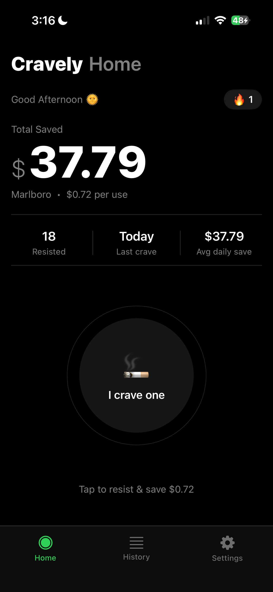
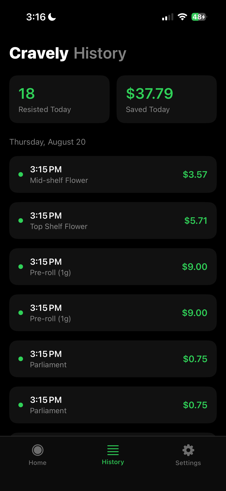
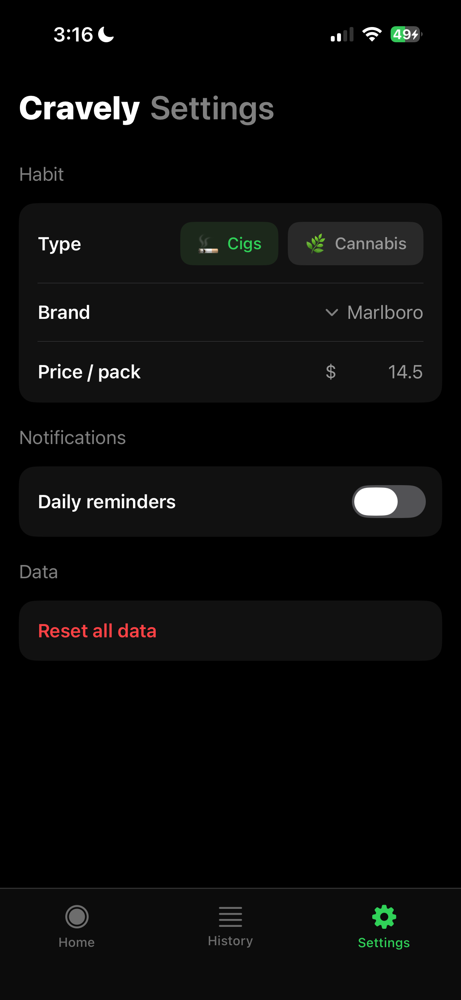

# Cravely 🚬🌿

Cravely is an iOS app that helps you quit cigarettes or cannabis by turning every craving you resist into a visible win — a running savings total, a streak, and a history you can look back on.

Built with **SwiftUI** and **SwiftData**, using an **MVVM** architecture, with **Home Screen and Lock Screen widgets** via WidgetKit.

<p align="center">
  
  
  
</p>

## How it works

Instead of tracking what you consume, Cravely tracks what you *resist*. Every time you feel a craving and tap "I crave one," the app logs it as a win, adds the unit price of your habit to your running savings total, and keeps your streak alive.

## Features

- **Resist button** — one tap to log a resisted craving, with a satisfying smoke-dissipation animation
- **Savings tracker** — running total of money saved, calculated from your habit's real unit price
- **Streaks** — consecutive-day tracking that stays alive as long as you log at least one resist per day
- **Daily stats** — cravings resisted, time since your last craving, and average daily savings
- **History** — a day-by-day log of every resisted craving
- **Habit & brand selection** — choose between cigarettes or cannabis, then pick a specific brand/product (Marlboro, Newport, American Spirit, pre-rolls, flower, vape carts, edibles, concentrates, etc.), each with realistic default pricing that's automatically converted to a per-use cost
- **Onboarding flow** — notification permission, habit type, and brand/product selection on first launch
- **Daily reminders** — optional 8 PM local notification to reinforce the habit
- **Home Screen & Lock Screen widgets** — streak and savings totals at a glance, without opening the app (see below)
- **Dark, minimal UI** — a focused black-and-white interface designed to keep the "resist" action front and center

## Widgets

<p align="center">
<<<<<<< HEAD
  
=======>>>>>>> 124a839d85093528f77d6ba75df2a88bbcd1453c
</p>

The `CravelyWidget` extension mirrors the app's dark, minimal look across five widget families:

| Family | What it shows |
|---|---|
| Home Screen — Small | Habit icon, streak, total saved |
| Home Screen — Medium | Total saved + brand/unit price, streak, resisted count, last crave |
| Lock Screen — Circular | 🔥 + streak number |
| Lock Screen — Rectangular | Total saved + streak |
| Lock Screen — Inline | Streak + total saved as a single line |

**How the data gets to the widget:** the app and widget are separate processes, so they can't share in-memory state or a private SwiftData container directly. Instead:

1. `HomeViewModel` already computes everything `HomeView` needs (streak, total saved, last crave, etc.) from the SwiftData `@Query`.
2. Whenever that data changes, `HomeView` calls `updateWidgetSnapshot(from:settings:)`, which packages those same numbers into a small `Codable` struct (`CravelySnapshot`) and writes it to a shared **App Group** `UserDefaults` suite via `SharedStore`.
3. It then calls `WidgetCenter.shared.reloadAllTimelines()`, so the widget refreshes within a couple seconds of tapping "I crave one" — no polling, no duplicate SwiftData container in the widget extension.
4. `CravelyProvider` (a `TimelineProvider`) reads that snapshot and also schedules an hourly fallback refresh, in case the app hasn't been opened in a while.

This keeps the widget's numbers always in sync with what the app itself is showing, and keeps the widget extension lightweight — it never touches SwiftData.

## Tech stack

| Layer | Technology |
|---|---|
| UI | SwiftUI |
| Architecture | MVVM |
| Persistence | SwiftData |
| Widgets | WidgetKit, shared via App Group `UserDefaults` |
| Notifications | UserNotifications |
| Language | Swift |

## Project structure

```
CravelyApp/
├── CravelyAppApp.swift          # App entry point
├── NotificationManger.swift     # Local notification scheduling & permissions
├── Models/
│   └── TapModel.swift           # SwiftData model for a logged "resist" event
├── Shared/
│   └── CravelySnapshot.swift    # Codable snapshot + App Group store, shared with the widget target
├── Screens/
│   ├── Home/                    # Main screen — resist button, stats, streak
│   ├── History/                  # Day-by-day log of resisted cravings
│   └── Settings/                 # Habit type, brand/product, pricing, reminders
└── Views/
    ├── ContentView.swift        # Root tab container
    ├── LunchScreenView.swift    # Launch/splash screen
    └── OnboadingFlowView.swift  # First-launch onboarding flow

CravelyWidget/
├── CravelyWidgetBundle.swift    # @main widget entry point
├── CravelyWidget.swift          # Widget configuration & supported families
├── CravelyProvider.swift        # TimelineProvider reading the shared snapshot
└── CravelyWidgetEntryView.swift # Adaptive view for all widget families
```

## Getting started

1. Clone the repo
   ```bash
   git clone https://github.com/aymantx1/Cravely.git
   ```
2. Open `CravelyApp.xcodeproj` in Xcode
3. Select the `CravelyApp` scheme and a simulator or device running iOS 17+ (required for SwiftData), then Build & Run
4. Open the app once before adding the widget — this seeds the initial snapshot in the shared App Group container

## Requirements

- Xcode 15+
- iOS 17+
- Swift 5.9+
- An Apple Developer Team selected on both the `CravelyApp` and `CravelyWidget` targets (a free personal team works) with the same App Group (`group.com.aymancodes.CravelyApp`) enabled on both

## Roadmap

- 🔓 Interactive widgets — log a resist directly from the Lock Screen (iOS 17+ `AppIntent`-backed button)
- ☁️ Optional iCloud sync across devices
